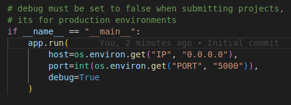

# Simple Flask application

This repository is for learning how the python framework Flask is used with web development.

## Important notes

On submitting projects of any kind change the debug value.

Reason: Security issue.

"debug" must be set to false when submitting projects,
it's for production environments.

